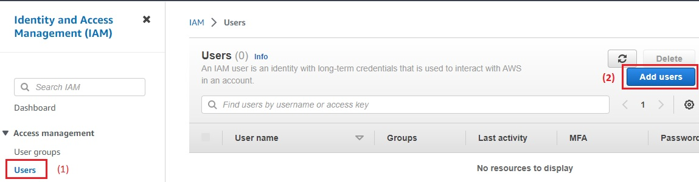
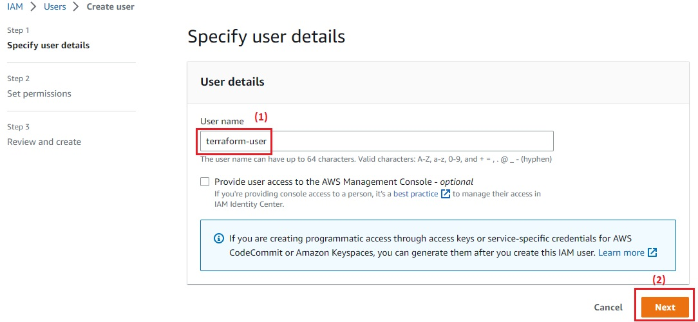
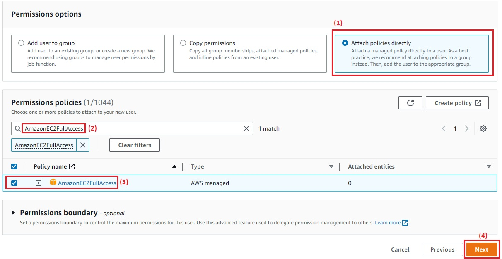
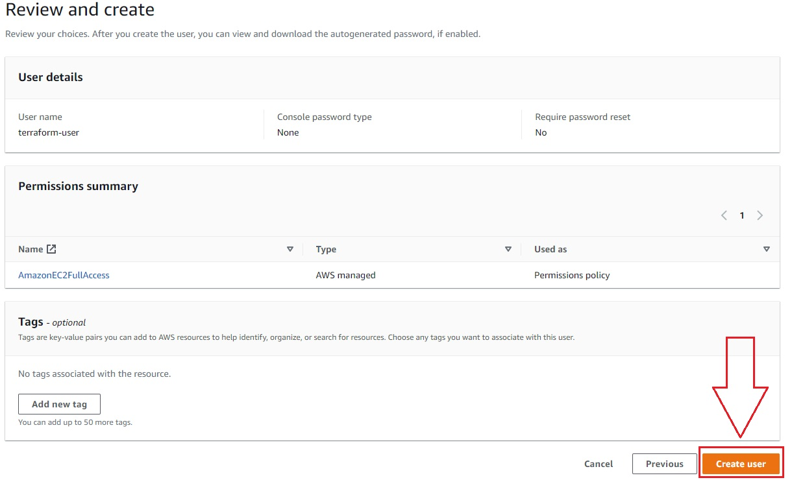
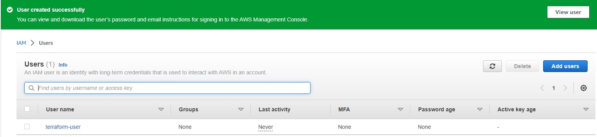
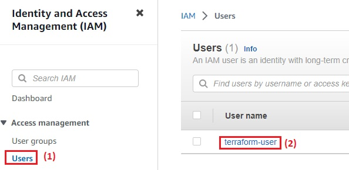
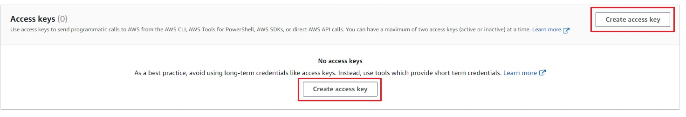
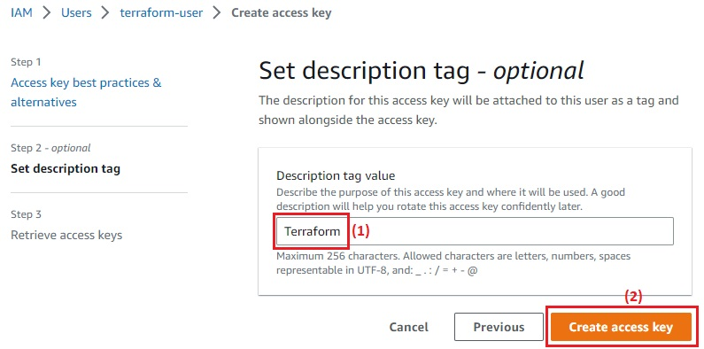
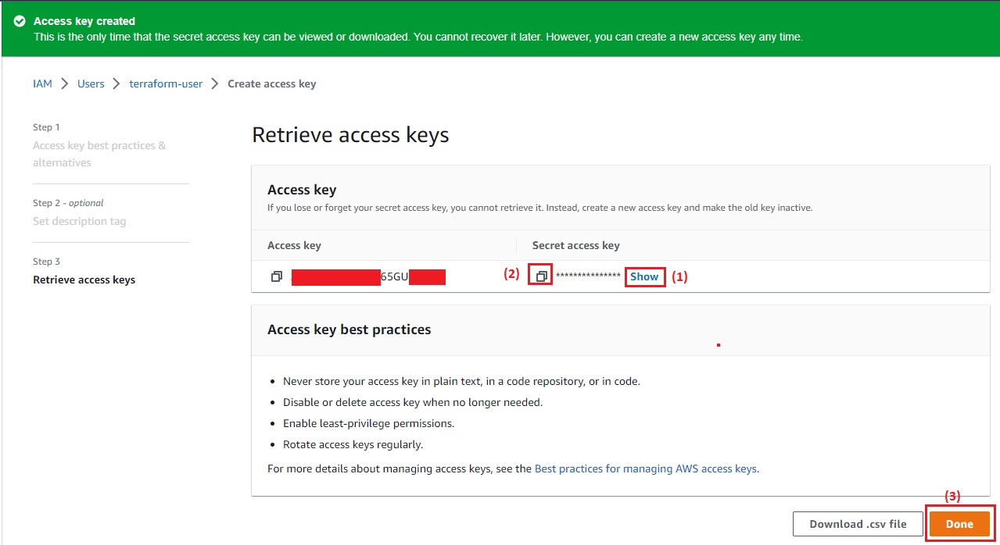

Configuration du Compte AWS

Lors dr la premieres inscription à AWS, vous vous connectez initialement en tant qu'utilisateur root. Ce compte d'utilisateur a un accès complet, donc du point de vue de la sécurité, je vous recommande de l'utiliser uniquement pour créer d'autres comptes d'utilisateurs avec des autorisations plus limitées.


Pour créer un compte d'utilisateur AWS limité :

- Se rendre sur la console du service [Identity Access Management (IAM)](https://console.aws.amazon.com/iam/home) 
- Cliquer sur ```Users```, puis sur le bouton bleu ```Add User```.



- Saisir un nom pour l'utilisateur. Par exemple : ```terraform-user```.
- Cliquer sur le bouton ```Next``` :



-  Cocher la case  ```Attach policies directly```,
-  Choisir la policy déjà pré-configurée d'AWS nommée ```AmazonEC2FullAccess```,
-  Cliquer sur "Next"



- Vérifier les informations
- Cliquer sur ```Create user```



- Le message suivant s'affiche 



Pour créer une clé d'accès :

- Accéder à [la liste des utilisateurs](https://us-east-1.console.aws.amazon.com/iamv2/home#/users)
- Selectionner l'utilisateur crée ( dans mon cas : ```terraform-user``` )



- Sélectionner l'onglet ```Security credentials```
- Cliquer sur ``` Create Access Key ```



- Choisir le cas d'utilisation de la clé d'accès ( J'ai choisit ```Local code```), Ensuite cocher la case en bas et cliquer sur ```Next```.
- Décrire le cas d'utilisation de la clé ( J'ai écrit Terraform )
- Cliquer sur ``` Create access key ```



- Il faut Copier le ``` Secret access key ``` dans un endroit sûr parce qu'il n'est visible qu'une seule fois.



- L'utilisateur est dorénavant prêt à être utilisé