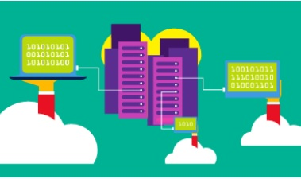
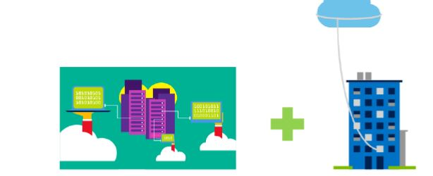
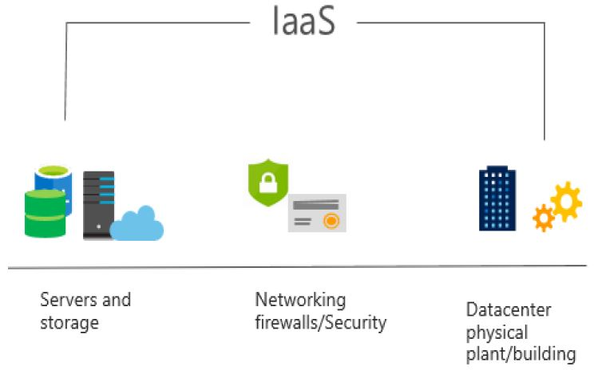
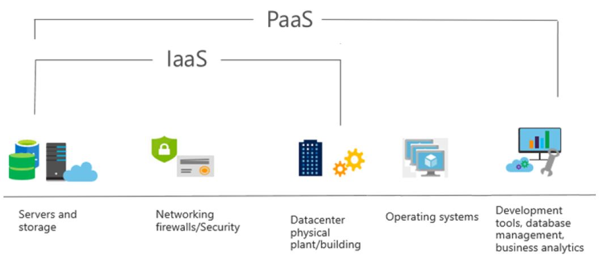
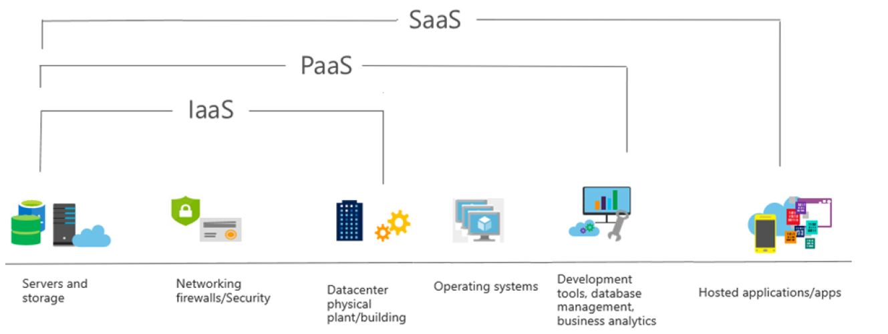
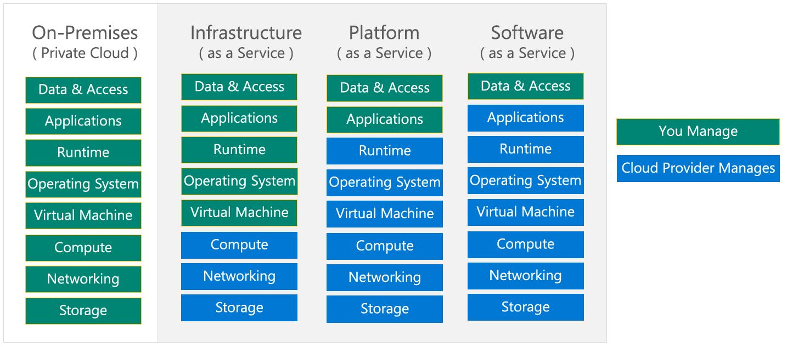

# Azure : Les fondamentaux

Modules                                                    | % | 
:------------                                            | :---------:  | 
Les concepts du cloud                                          | 20-25% | 
Les services Azure de base                                     | 15-20% | 
Les solutions de base et les outils de gestion                 | 10-15% | 
La sécurité générale et la sécurité du réseau                  | 0-15%  | 
L'identité, la gouvernance, la confidentialité et la conformité| 20-25% |
La gestion des coûts Azure et les accords de niveau de service | 10-15%|  

- Ce Tuto est une préparation  au certification AZ-900 Microsoft Azure Fundamentals.
- Les % indiquent le poids relatif de chaque module dans l'examen.
- Plus le pourcentage est élevé, plus vous êtes susceptible de voir des questions dans ce domaine.

# Module 1 : Les concepts du cloud

### Module 01 : Les grandes lignes

Les notions suivantes seront expliquées

- Les Modèles du cloud
    - Public, Private et cloud Hybrid.
    - Choisir la solution à son utilisation
- Avantages et considérations du cloud
    - Avantages du Cloud
    - Considérations sur le cloud
- Les différents services Cloud
    - IaaS, PaaS, and SaaS
    - Partager la responsabilité

## 1.1 Les Modèles du cloud

Le Cloud computing est l'utilisation de services informatiques via le réseau, permettant une innovation plus rapide, des ressources flexibles et des économies d'échelle.

#### 1.1.1 Définir le cloud computing

- Propriété de services cloud ou d'hébergement
fournisseur.
- Fournit des ressources et des services aux
plusieurs organisations et utilisateurs.
- Accessible via un réseau sécurisé
connexion (généralement sur le
l'Internet).
### 1.1.2 Définir le Cloud Public.

- Propriété de services cloud ou de l'hébergeur.
- Fournit des ressources et des services aux plusieurs organisations et utilisateurs.
- Accessible via un réseau sécurisé connexion (généralement sur le l'Internet).

     

### 1.1.3 Décrire le cloud privé

- Les organisations créent un environnement cloud dans leur centre de données.
- L'organisation est responsable de l'exploitation des services qu'ils fournissent.
- Ne donne pas accès aux utilisateurs en dehors de l'organisation.

     

### 1.1.4 Décrire le cloud hybride

- Combine les clouds publics et privés pour permettre aux applications de s'exécuter dans le plus grand nombre
emplacement approprié.
     

### 1.1.5  Comparez et contrastez les trois différents modèles de cloud

Service Cloud  | Description
-------------  | -------------
Public         | Pas de dépenses en capital à mettre à l'échelle.
               | Les applications peuvent être rapidement provisionnées et déprovisionnées.
               | Les organisations ne paient que pour ce qu'elles utilisent.
               |
Privé          | Le matériel doit être acheté pour le démarrage et la maintenance.
               | Les applications peuvent être rapidement provisionnées et déprovisionnées.
               | Les organisations ne paient que pour ce qu'elles utilisent.
Hybride        | Fournit le plus de flexibilité.
               | Les organisations décident où deployer ses applications.
               | Les organisations contrôlent la sécurité, la conformité ou les exigences légales

## 1.2  Avantages et considérations du cloud

### 1.2.1 Identifier les avantages du cloud computing comme la haute disponiblité , l'évolutivité (la scalabilité) , elesticit, agilité et reprise après sinistre.

- Haute disponibilité (99,99% du temps )
- Scalabilité
- Portée mondiale ( Global reach)
- Agilité
- Tolérance aux pannes
- Elasticité
- Considérations relatives aux coûts prévisionnels

### 1.2.2 Identifier la différence entre CapEx et OpEx.

- CapEx : dépenses d'investissement ( Capital Expenditure).
    - Les dépenses initiales d'argent sur l'infrastructure physique.
    - Les coûts de CapEx ont une valeur qui diminue avec le temps.

- OpEx : dépenses d'exploitation ( Operational Expenditure).

    - Les dépenses et la facturation de services ou de produits selon les besoins
    - Les dépenses sont déduites la même année.

### 1.2.3 Décrire le modèle basé sur la consommation
- Les fournisseurs de service cloud propose un service basé sur la consommation. Ceci dit, ll'utilisateur final paie seulement pour la resource utilisée.
    - Bonne méthode pour prédir le cost
    - Les prix des ressources et des services individuels sont fournis
    - La facturation est basée sur l'utilisation réelle
## 1.3  Les différents services Cloud

### 1.3.1 Infrastructure-as-a-Service (IaaS)

- Construction d'une infrastructure informatique pay-as-you-go en louant des serveurs, des machines virtuelles, du stockage,
réseaux et systèmes d'exploitation d'un fournisseur de cloud.
     
### 1.3.2 Platform-as-a-Service (PaaS)

- Fournit un environnement pour créer, tester et déployer des applications  ; sans pour autant
en se concentrant sur la gestion de l'infrastructure sous-jacente.
     

### 1.3.3 Software-as-a-Service (SaaS)
- Les utilisateurs se connectent et utilisent des applications basées sur le cloud via internet. Par exemple : Microsoft Office 365 messagerie et calendriers
   
### 1.3.4 Identifier un type de service en fonction d'un cas d'utilisation
- Comparaisons des services Cloud:

| Iaas    | PaaS   | Saas   |
|:------: |:------:|:------:|
| Le service cloud le plus flexible |  Se concentrer sur le developpement des applications| Modèle pay-as-you-go|
|L'utilisateur configure et gére le hardware pour son application. | La gestion de la plateforme est géré par le fournisseur du cloud. | Les utilisateurs paient l'utilisation du logiciel via un abonnement universel |

### 1.3.5 Décrire le modèle de responsabilité partagée

   

### 1.3.6 Serverless computing (L'informatique sans serveur)

- Azure Functions:est le code qui exécute votre service et non le plate-forme ou infrastructure sous-jacente. Ça crée infrastructure basée sur un événement
- Azure Logic Apps:est un service cloud qui vous aide
automatiser et orchestrer les tâches, les processus métier et workflows lorsque vous devez intégrer des applications, des données, des systèmes, Et services

!!! note 
    Avec Serverless computing, le fournisseur de services cloud provisionne, dimensionne et gère automatiquement l'infrastructure requise pour exécuter le code.

# Module 2 : Les services Azure de base

## 2.1 : Composants architecturaux Azure

### 2.1.1 : Régions et zones de disponibilité

### 2.1.2 : Abonnements et groupes de ressources

## 2.2 : Ressources Azure de base

### 2.2.1 : Calcul

### 2.2.2 : Réseau

### 2.2.3 : Stockage

### 2.2.4 : Base de données

# Module 3 : Les solutions d'Azure et ses outils de gestion

# Module 4 : La sécurité Azure et la sécurité réseau

# Module 5 : Identité, gouvernance, confidentialité et conformité

# Module 6 : Tarifications et cycle de vie Azure