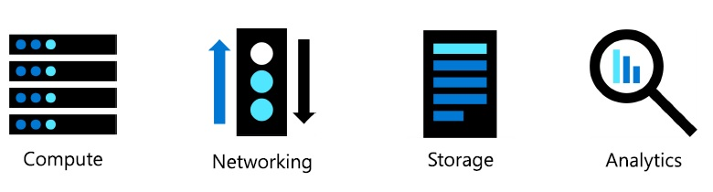

# Azure : Les fondamentaux

Modules                                                    | % | 
:------------                                            | :---------:  | 
Les concepts du cloud                                          | 20-25% | 
Les services Azure de base                                     | 15-20% | 
Les solutions de base et les outils de gestion                 | 10-15% | 
La sécurité générale et la sécurité du réseau                  | 0-15%  | 
L'identité, la gouvernance, la confidentialité et la conformité| 20-25% |
La gestion des coûts Azure et les accords de niveau de service | 10-15%|  

- Ce Tuto est une préparation  au certification AZ-900 Microsoft Azure Fundamentals.
- Les % indiquent le poids relatif de chaque module dans l'examen.
- Plus le pourcentage est élevé, plus vous êtes susceptible de voir des questions dans ce domaine.

# Module 1 : Les concepts du cloud

### Module 01 : Les grandes lignes

Les notions suivantes seront expliquées

- Les Modèles du cloud
    - Public, Private et cloud Hybrid.
    - Choisir la solution à son utilisation
- Avantages et considérations du cloud
    - Avantages du Cloud
    - Considérations sur le cloud
- Les différents services Cloud
    - IaaS, PaaS, and SaaS
    - Partager la responsabilité

## 1.1 Les Modèles du cloud

Le Cloud computing est l'utilisation de services informatiques via le réseau, permettant une innovation plus rapide, des ressources flexibles et des économies d'échelle.

#### 1.1.1 Définir le cloud computing

- Propriété de services cloud ou d'hébergement
fournisseur.
- Fournit des ressources et des services aux
plusieurs organisations et utilisateurs.
- Accessible via un réseau sécurisé
connexion (généralement sur le
l'Internet).
#### 1.1.3 Décrire le cloud privé
- Les organisations créent un cloud
environnement dans leur centre de données.
- L'organisation est responsable de
l'exploitation des services qu'ils fournissent.
- Ne donne pas accès aux utilisateurs
en dehors de l'organisation.
#### 1.1.4 Décrire le cloud hybride

- Combine les clouds publics et privés pour permettre aux applications de s'exécuter dans le plus grand nombre
emplacement approprié.

#### 1.1.5 Comparez et contrastez les trois différents modèles de cloud

## 1.2  Avantages et considérations du cloud

## 1.3  Les différents services Cloud

