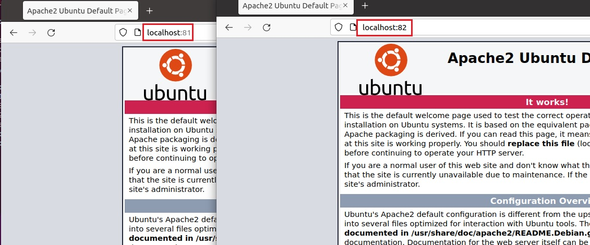

# Docker : First Steps

---
##  Lab 1 : Installation
---

According to [Docker Docs](https://docs.docker.com/engine/install/ubuntu/), Docker Engine can be installed in different ways, depending on our needs:
-   Most users set up Docker’s repositories and install from them, for ease of installation and upgrade tasks. This is the recommended approach.

-   Some users download the DEB package and install it manually and manage upgrades completely manually. This is useful in situations such as installing Docker on air-gapped systems with no access to the internet.

-   In testing and development environments, some users choose to use automated convenience scripts to install Docker.

###  Linux 

#### For Ubuntu
#### 1. Set up the repository (Docker CE):

- Install packages to allow apt to use a repository over HTTPS.
```
sudo apt-get update
sudo apt-get install apt-transport-https ca-certificates curl gnupg-agent software-properties-common
``` 
- Add Docker’s official GPG key:

```sh
curl -fsSL https://download.docker.com/linux/ubuntu/gpg | sudo apt-key add -
```
- Set up the stable repository (amd64):
```sh
sudo add-apt-repository "deb [arch=amd64] https://download.docker.com/linux/ubuntu $(lsb_release -cs) stable"
```
#### 2. Install Docker
```
sudo apt-get update
sudo apt-get install docker-ce docker-ce-cli containerd.io
```
Executing the Docker Command Without Sudo (Optional):
```
sudo usermod -aG docker $(whoami)
```
!!! Note 
    You have to Log out and log back in so that your group membership is re-evaluated.

Configure Docker to start on boot
````
 sudo systemctl enable docker.service
 sudo systemctl enable containerd.service
````
Using the Docker Command

```
 sudo docker --help
 sudo docker info
 sudo docker "subcommand" --help
```
#### For CentOS
- Installation options are available on [Docker Docs for Centos](https://docs.docker.com/engine/install/centos/)
- Install using the repository
```
sudo yum install -y yum-utils
sudo yum-config-manager  --add-repo https://download.docker.com/linux/centos/docker-ce.repo
sudo yum install docker-ce docker-ce-cli containerd.io
```
- Start Docker Daemon
```
sudo systemctl start docker
sudo usermod -aG docker $USER
sudo chmod 777 /var/run/docker.sock
```
###  Windows 10 / 11

- https://docs.docker.com/desktop/windows/install/ 

---
## Lab 2: Build and Manager images (Dockerfile)
---

- Docker offers two types of images:
    - OS images (ubuntu, debian, etc)
    - Dockerized Services /Apps Images (http, nodejs, mongodb, etc)
- Images are stored in the Docker Registry (Local, or remote like Docker Hub and Docker Store)

- Different methods to create Docker image :

    1. Image pull : loads an archive of files, as a base layer
    2. Container commit : create new couche (+ image) from current container
    3. Image build : construction form a Dockerfile (commands list)

### Working with Docker Images : 


Search for images available on Docker Hub:
```
sudo docker search Ubuntu
```
Download ubuntu image to your computer
```
sudo docker pull ubuntu 
Using default tag: latest
latest: Pulling from library/ubuntu
ea362f368469: Pull complete
Digest: sha256:b5a61709a9a44284d88fb12e5c48db0409cfad5b69d4ff8224077c57302df9cf
Status: Downloaded newer image for ubuntu:latest
docker.io/library/ubuntu:latest
```
List all local docker images: 
```
sudo docker images
REPOSITORY   TAG       IMAGE ID       CREATED       SIZE
ubuntu       latest    d13c942271d6   3 weeks ago   72.8MB
```
Pull Ubuntu 20.04 image
```
sudo docker pull ubuntu:20.04 
```
List all local docker images: 
```
sudo docker images
REPOSITORY   TAG       IMAGE ID       CREATED       SIZE
ubuntu       20.04     d13c942271d6   3 weeks ago   72.8MB
ubuntu       latest    d13c942271d6   3 weeks ago   72.8MB
```
- Run a new container docker1
```
sudo docker run -it --name docker1 ubuntu:20.04 
```
- Run a new container docker2
```
sudo docker run -dt --name docker2 ubuntu:20.04 
```

!!! note

    -   d (detach): Run container in background and print container ID 
    -   i (interactive): Keep STDIN open even if not attached 
    -   t (tty): Allocate a pseudo-TTY  
    Use the following combination of keys instead: CTRL + P + Q. This command allows to leave the container without turning it off. If you use the exit command again within the container, it will shut down

#### Build Docker Images
-   Write a Dockerfile (Openssh and Apache2)
```
$ echo \ "FROM ubuntu:20.04
#Install Openssh Server, Apache2 and git 
ARG DEBIAN_FRONTEND=noninteractive
RUN apt-get update && apt-get install -y openssh-server git apache2 vim
#Configure ssh
RUN mkdir /var/run/sshd
RUN echo 'root:root' | chpasswd
RUN sed -i 's/PermitRootLogin prohibit-password/PermitRootLogin yes/' /etc/ssh/sshd_config
#Expose SSH and HTTP ports
EXPOSE 22 80">>Dockerfile
```

-   Build image
```
sudo docker build -t myimage .
```
```
Sending build context to Docker daemon  22.96MB 
Step 1/6 : FROM ubuntu:20.04 
 ---> 4a689991aa24 
Step 2/6 : RUN apt-get update && apt-get install -y openssh-server git apache2 python vim 
Removing intermediate container 02e7b71e66bf 
 ---> a02abb273ca1 
Step 3/6 : RUN mkdir /var/run/sshd 
 ---> Running in 7debc3bd848a 
^[[ARemoving intermediate container 7debc3bd848a 
 ---> 43701b93496d 
Step 4/6 : RUN echo 'root:root' | chpasswd 
 ---> Running in 4958eb98f69b 
Removing intermediate container 4958eb98f69b 
 ---> 86051bdd6380 
Step 5/6 : RUN sed -i 's/PermitRootLogin prohibit-password/PermitRootLogin yes/' /etc/ssh/sshd_config 
 ---> Running in df9955a1969b 
Removing intermediate container df9955a1969b 
 ---> ce0c596cd18b 
Step 6/6 : EXPOSE 22 80 
 ---> Running in 1ef65145106a 
Removing intermediate container 1ef65145106a 
 ---> 4fdd24f1b727 
Successfully built 4fdd24f1b727 
Successfully tagged myimage:latest 
```
List all local docker images
```
sudo docker images

REPOSITORY   TAG       IMAGE ID       CREATED          SIZE
myimage      latest    d83e3fd00475   40 seconds ago   365MB
ubuntu       20.04     d13c942271d6   3 weeks ago      72.8MB
ubuntu       latest    d13c942271d6   3 weeks ago      72.8MB
``` 
Build new version 'v1.0'
```
sudo docker build -t="myimage:v1.0" . 
Sending build context to Docker daemon  2.048kB
Step 1/7 : FROM ubuntu:20.04
 ---> d13c942271d6
Step 2/7 : ARG DEBIAN_FRONTEND=noninteractive
 ---> Using cache
 ---> 1382eae51bd9
Step 3/7 : RUN apt-get update && apt-get install -y openssh-server git apache2 vim
 ---> Using cache
 ---> b46e2d48bebb
Step 4/7 : RUN mkdir /var/run/sshd
 ---> Using cache
 ---> c5ac495fe893
Step 5/7 : RUN echo 'root:root' | chpasswd
 ---> Using cache
 ---> aed6d12fa09d
Step 6/7 : RUN sed -i 's/PermitRootLogin prohibit-password/PermitRootLogin yes/' /etc/ssh/sshd_config
 ---> Using cache
 ---> 89c476d90de8
Step 7/7 : EXPOSE 22 80
 ---> Using cache
 ---> d83e3fd00475
Successfully built d83e3fd00475
Successfully tagged myimage:v1.0
```
List all local docker images
``` 
sudo docker images 

REPOSITORY   TAG       IMAGE ID       CREATED         SIZE
myimage      latest    d83e3fd00475   6 minutes ago   365MB
myimage      v1.0      d83e3fd00475   6 minutes ago   365MB
ubuntu       20.04     d13c942271d6   3 weeks ago     72.8MB
ubuntu       latest    d13c942271d6   3 weeks ago     72.8MB

```
---
## Lab 3 : Manage Containers (Life Cycle, SSH, Port Forwarding)
---
### Create One container
- Remove all existing containers
```
sudo docker rm -f $(sudo docker ps -a -q) 
```
Create a container with the new image
```
sudo docker run -it --name docker1 myimage
root@8cdc395b34ca:/# exit
exit
docker ps
CONTAINER ID   IMAGE     COMMAND   CREATED   STATUS    PORTS     NAMES
docker start docker1
docker1
docker exec -d docker1 ls
docker attach docker1
root@8cdc395b34ca:/#
root@8cdc395b34ca:/# exit
exit
sudo docker run -dt --name docker2 myimage bin/sh  -c "while true; do echo hello world; sleep 1; done"
7f192eb6f5bf7079843b30e1f7d3b2e7b4f8f12bb7c48a63101760e814633c07
# Display Docker2 logs
sudo docker logs docker2
hello world
hello world
hello world
hello world
docker top docker2
UID                 PID                 PPID                C                   STIME               TTY                 TIME                CMD
root                18654               18630               0                   17:50               pts/0               00:00:00            bin/sh -c while true; do echo hello world; sleep 1; done
root                18908               18654               0                   17:52               pts/0               00:00:00            sleep 1
# Stop the VMs
sudo docker stop docker1 docker2
# Delete the VMs
sudo docker rm docker1 docker2
```
### Create 2 containers with port forwarding:
There are two methods for assigning network ports to the Docker host:

- Docker can randomly assign a port (in the range 32768-61000) from the Docker host that it will map to the port 80 of the container.
- It is also possible to specify a port (for ex. 81 and 82)

````
# Delete all containers
sudo docker rm -f $(sudo docker ps -a -q)
# Create 2 new containers
sudo docker run -dt -p 81:80 --name docker1 myimage
sudo docker run -dt -p 82:80 --name docker2 myimage
sudo docker ps
sudo docker info
````
#### Access with SSH:
Start SSH Daemon
````
sudo docker exec -d docker1 /etc/init.d/ssh start 
sudo docker exec -d docker2 /etc/init.d/ssh start
````
- Check IP Address of containers
````
sudo  docker inspect docker1 
# get only the Ipv4 Adress
sudo docker inspect --format '{{ .NetworkSettings.IPAddress }}' docker1 172.17.0.2
172.17.0.2
ssh root@172.17.0.2
# You can change the root password by running the following docker command:
docker exec -itu 0 docker1 passwd

````
#### Start Apache2 Server:
- Start Apache2 server

```
sudo docker exec -d docker1 /etc/init.d/apache2 start 
sudo docker exec -d docker2 /etc/init.d/apache2 start
```
###### -  On browser try to connect : 
- http://localhost:80

- http://localhost:81




#### Delete all containers (runining and stoped)

#### Running web application:

### Use Docker Commit to create images

---
## Lab 4 : Link containers (Mysql, Wordpress and Phpmyadmin)
---

---
## Lab 6 : Manage Network

---

---
## Lab 7 : Docker Hub
---

---
## Lab 8 : Manage Docker Registry
---