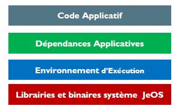

# Présentation : Docker
## 1. Introduction 

!!! note "Dans cette présantion, je vous donnerai des réponses aux questions suivantes :"
    - Conteneurs Linux LXC et Conteneurs Docker: Quelle(s) différence(s)?
    - Pourquoi utiliser des conteneurs plutôt que des Machines Virtuelles?
    - Pourquoi utilise-t-on Docker et quelles sont ses atouts dans le développement et le déploiement des applications cloud-native?
    - Conteneurs, sont-ils vraiment populaires dans les Data Center / Cloud Computing?
    - Docker, Cloud, DevOps et microservices, quel lien?

### Big Picture ...

### Infrastructure IT: Changement de vitesse

### Docker (utilisation 2021)

### Adoption de la Technologie Conteneur Docker

### La Technologie Conteneur révolutionne le Cloud

### Docker = La voie vers DevOps

!!! Note "DevOps = Intégration Continue & Déploiement Continu (CI/CD)"
## 2. Le Challenge

#### Services ET Environnements multiples : Comment déployer?

#### Produits ET Moyens multiples = Comment transporter?

#### Usage des conteneurs = Portabilité

#### Qu’est ce qu’un Conteneur ?

- Un processus s’exécutant sur son propre système de fichiers
    - Vision limitée du système sur lequel il tourne
    - Optimisation de l'usage des ressources
    - Le noyau quant à lui, est partagé avec le système hôte.

- Dérivé du principe de CHROOT (sous Unix) et de mécanisme d’isolation de système de fichiers

- Une application packagée dans un Rootfs

- Un Rootfs (le / d'un Linux) qui est appelé image contient :

     

## 3. Conteneur Linux LXC
#### LXC : C’est quoi?
- La virtualisation par conteneurs se base sur la virtualisation Linux LXC, pour Linux Containers.
- Il s’agit d’une méthode de cloisonnement au niveau de l’OS.
- LXC est utilisé pour faire fonctionner plusieurs instances Linux isolés les uns des autres dans des conteneurs partageant le même noyau et une petite partie du système hôte.

#### Chroot par rapport à LXC

- Chroot est moins sécurisé :

    - Un conteneur chrooté partage son /proc et son /dev avec l'hôte, et il a donc tout liberté pour s'introduire dans le système

- Chroot donne une isolation moins faible :

    - Même si le système de fichier d’un conteneur est correctement isolé, les processus (liés aux services qui tournent dedans) ne sont pas isolés (ils peuvent voir ceux de l’hôte)
    - Les services d’un conteneur écoutent sur la même interface réseau
    - Il n'est pas pratique du tout dés qu'il s'agit de faire tourner plein de services dans le conteneur

- LXC offre un jeu de nouvelles techniques d’isolation dans le kernel permettant de créer facilement un super-chroot beaucoup plus isolant que la version d'origine.

## 4. Contenurs VS Machines virtuelles

## 5. Plateforme Docker

## 6. Images Docker