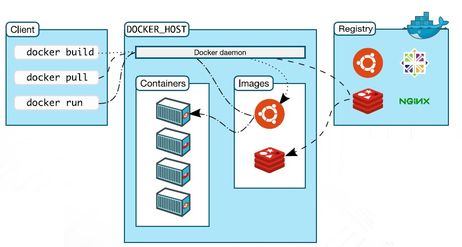

# Présentation : Docker
___
## 1. Introduction 
___

!!! note "Dans cette présentation, je vous donnerai des réponses aux questions suivantes :"
    - Conteneurs Linux LXC et Conteneurs Docker: Quelle(s) différence(s)?
    - Pourquoi utiliser des conteneurs plutôt que des Machines Virtuelles?
    - Pourquoi utilise-t-on Docker et quelles sont ses atouts dans le développement et le déploiement des applications cloud-native?
    - Conteneurs, sont-ils vraiment populaires dans les Data Center / Cloud Computing?
    - Docker, Cloud, DevOps et microservices, quel lien?

PS : les chapitres 1 & 2 ne contiennent que des explications visuelles, la rédaction commence à la fin du chapitre 2.

### Big Picture ...

### Infrastructure IT: Changement de vitesse

### Docker (utilisation 2021)

### Adoption de la Technologie Conteneur Docker

### La Technologie Conteneur révolutionne le Cloud

### Docker = La voie vers DevOps

!!! Note "DevOps = Intégration Continue & Déploiement Continu (CI/CD)"
___
## 2. Le Challenge
___

#### Services ET Environnements multiples : Comment déployer?

#### Produits ET Moyens multiples = Comment transporter?

#### Usage des conteneurs = Portabilité

#### Qu’est ce qu’un Conteneur ?

- Un processus s’exécutant sur son propre système de fichiers
    - Vision limitée du système sur lequel il tourne
    - Optimisation de l'usage des ressources
    - Le noyau quant à lui, est partagé avec le système hôte.

- Dérivé du principe de CHROOT (sous Unix) et de mécanisme d’isolation de système de fichiers

- Une application packagée dans un Rootfs

- Un Rootfs (le / d'un Linux) qui est appelé image contient :

     

___
## 3. Conteneur Linux LXC
___
#### LXC : C’est quoi?
- La virtualisation par conteneurs se base sur la virtualisation Linux LXC, pour Linux Containers.
- Il s’agit d’une méthode de cloisonnement au niveau de l’OS.
- LXC est utilisé pour faire fonctionner plusieurs instances Linux isolés les uns des autres dans des conteneurs partageant le même noyau et une petite partie du système hôte.

#### Chroot par rapport à LXC

- Chroot est moins sécurisé :

    - Un conteneur chrooté partage son /proc et son /dev avec l'hôte, et il a donc tout liberté pour s'introduire dans le système

- Chroot donne une isolation moins faible :

    - Même si le système de fichier d’un conteneur est correctement isolé, les processus (liés aux services qui tournent dedans) ne sont pas isolés (ils peuvent voir ceux de l’hôte)
    - Les services d’un conteneur écoutent sur la même interface réseau
    - Il n'est pas pratique du tout dés qu'il s'agit de faire tourner plein de services dans le conteneur

- LXC offre un jeu de nouvelles techniques d’isolation dans le kernel permettant de créer facilement un super-chroot beaucoup plus isolant que la version d'origine.

#### LXC : Technologies de base

- LXC repose sur la notion de groupes de contrôle Linux (cgroups) disponibles depuis sa version 2.6.24
    - Chaque groupe de contrôle permet de limiter et d’isoler l’utilisation des ressources qu’un processus peut utiliser (processeur, mémoire, réseau, système de fichier et accès E/S), et ce sans recourir à des machines virtuelles à part entière.
- LXC repose aussi sur une isolation des espaces de nommage du noyau (namespace):
    - Permet d’empêcher qu’un groupe puisse « voir » les ressources des autres groupes (systèmes de fichiers, les ID réseau et les ID utilisateur)
- LXC repose sur les bibliothèques Profils Apparmor (Application Armor) et SELinux (Security-Enhanced Linux) pour la sécurité :
    - En termes des restrictions, permissions et droits utilisateur
#### LXC : Vue d’ensemble

#### Docker : Un LXC augmenté

- Docker ne remplace pas les conteneurs Linux LXC (lancé en 2013)
- L'idée consiste à utiliser LXC comme base, puis à ajouter des capacités de niveau supérieur
- Docker autorise la portabilité entre machines (qui exécutent aussi Docker) et permet ainsi à une application et à ses composants d'exister en tant qu'objet mobile unique.
- Avec LXC, déplacer une application sur une autre machine peut introduire des différences susceptibles d'empêcher le conteneur de l'application de s'exécuter.

#### Docker pour les DEV

- Build once… run everywhere
- Un conteneur Docker est un environnement sécurisé, stable, portable sur tous environnements
- Docker résout les problèmes de dépendances ou de packages manquant lors du déploiement

#### Docker pour les DEV

- Configure once… run everywhere
- Rend le cycle de vie des applications plus efficace, consistant, et reproductible
- Améliore le rendu de la qualité du code développé
- Élimine définitivement les inconsistances entre les différents environnements de développement, test, et production

#### Docker pour l’entreprise

- Une même plate-forme pour toutes les applications
- Accélère la mise en place de pipelines de déploiement automatiques
- Interface commune qui permet aux Devs et Ops de travailler ensemble
- Améliore l’autonomie et la productivité des équipes Dev et Ops
!!! note " ==> Agilité, Portabilité, Consistance, Optimisation des coûts, Elasticité/Scalabilité… "

### Histoire

- 2008 : dotCloud, co-fondée by Solomon Hykes
    - PaaS
    - o	Début de la plate-forme Docker qui simplifie l’usage des containers Linux
- 2010 : dotCloud incubée à Ycombinator
- 2011 : Plate-forme Docker mise en open source
- 2013 : Création de Docker.Inc pour soutenir le projet
- 2017 : Dissociation du produit Docker et du projet Moby

### Format des conteneurs Docker

- Avant Docker 0.9
    - Utilisation de la technologie LXC pour gérer les containers

- Depuis Docker 0.9
    - Access direct à l’API des containers Linux
    - Utilisation de la librairie libcontainer (un wrapper qui combine les Namespaces + Cgroup + UnionFS)
    - UnionFS offre un stockage sur plusieurs couches en lecture seule (léger et rapide), utilisé pour fournir les blocs de construction des conteneurs

### Editions Docker : CE et EE

### Open Container Initiative OCI

- Démarche initiée par Docker et CoreOS et créée par la Linux Foundation en 2015
- Créer une gouvernance des technologies de containers (spécifications et standardisation minima autour des technologies de containerisation)
    - Unification des formats de containers (Docker, Rocket…)
    - Standardiser les formats des images de containers pour faciliter l’interopérabilité entre les solutions du marché et les cloud providers
    - Standardiser certaines actions des moteurs « runtime » afin de disposer de commandes communes (start, exec, pause..)

___

## 4. Conteneurs VS Machines virtuelles
___

#### Hyperviseur vs Docker

#### Hyperviseur vs Docker (Analogie)

  

!!! note "Pourquoi des conteneurs plutôt que des machines virtuelles ?"

-Les conteneurs Docker révolutionnent la virtualisation car l’idée n’est pas nouvelle
- La virtualisation a un coût car les OS invités requièrent chacun des ressources (mémoire, CPU, réseaux)
- Augmentation de la taille de chaque machine virtuelle, ce qui limite le
nombre de machines virtuelles qu'un serveur peut héberger 
- La conteneurisation vise à virtualiser les applications sans trop alourdir le système
- Favoriser l'intégration rapide d'applications dans des conteneurs.
#### Des conteneurs dans des VMs ?
- 
- 

## 5. Plateforme Docker

#### Docker : Vue d’ensemble

## 6. Images Docker