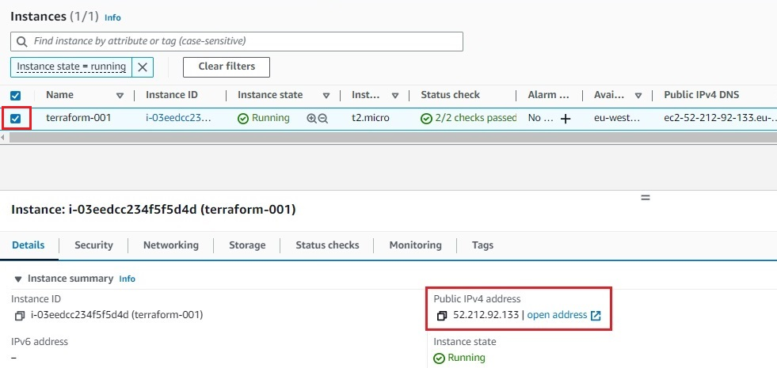
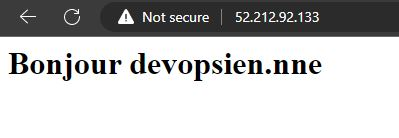

# Terraform Lab


Terraform est un outil qui permet de créer, modifier et versionner une infrastructure de manière sûre et efficace.

Il peut gérer différents fournisseurs d'infrastructure du Cloud Public (AWS, Azure, OVH, GcP, Alibaba Cloud, etc ...) ainsi que des solutions du cloud privé internes personnalisées (VmWare, Openstack, Kubernetes, etc ...)

Cette page est un tutoriel pour créer un première infrastructure cloud sur AWS avec terraform.

### 1. Prérequis

Avant de commencer ce tutoriel, il faut s'assurer que les prérequis suivants sont présents : 

=== "AWS"

    - Avoir un compte AWS. Le compte peut être crée ici [https://aws.amazon.com/fr/free](https://aws.amazon.com/fr/free)
    - Terraform installé [https://developer.hashicorp.com/terraform/downloads](https://developer.hashicorp.com/terraform/downloads)
    - Créer La clé d'accès AWS [https://console.aws.amazon.com/iam](https://console.aws.amazon.com/iam)
    - Ce document détaille [La création de la clé d'accès sur AWS ](../../Cloud/AWS02).

=== "OVH"
    - Avoir un compte OVHCloud
    - Terraform installé [https://developer.hashicorp.com/terraform/downloads](https://developer.hashicorp.com/terraform/downloads)
    - Générer des identifiants depuis [cette page](https://www.ovh.com/auth/api/createToken?GET=/*&POST=/*&PUT=/*&DELETE=/*)

=== "Azure"
    ``` terraform title="Ce n'est pas encore disponible"


    ```

### 2. Premier code terraform : 

Commençant par la création un fichier main.tf, dans un dossier vide,  contenant le code suivant : 

=== "AWS"

    ``` terraform title="Définir le cloud provider , la région et les codes d'accès à utiliser "

    # Ce code permet de 

    provider "aws" {
        region = "eu-west-1" # La région d'irlande'
        access_key = "ta-clé-dacces" #
        secret_key = "ta-clé-secrète"
    }
    ```

=== "OVH"

    ``` terraform title="Définir le cloud provider , la région et les codes d'accès à utiliser "

    provider "ovh" {
        endpoint           = "ovh-eu"
        application_key    = "saisir-application-key"
        application_secret = "saisir-application-secret"
        consumer_key       = "saisir-consumer-key"
    }
    ```

=== "Azure"
    ``` terraform title="Ce n'est pas encore disponible"


    ```


    Ensuite, ajouter ces lignes en dessous du code précedent dans le même fichier main.tf

    === "AWS"

        ``` terraform title="L'instance AWS à créer"

        resource "aws_instance" "my_ec2_instance" {
            ami = "ami-0cc4e06e6e710cd94" # Ubuntu server 20.04 LTS SSD volume type
            instance_type = "t2.micro" # 1vCPU 1 Go RAM - inclus dans l'offre gratuit de AWS
        }

        ```
    
    === "OVH"
        ``` terraform title="Ce n'est pas encore disponible"


        ```
    === "Azure"

        ``` terraform title="Ce n'est pas encore disponible"


        ```

### 3. Creation de l'instance 

En combinant les exemples précédents, nous nous retrouvons avec le code suivant :

=== "AWS"

    ```` terraform title="main.tf"

    provider "aws" {
        region = "eu-west-1" # La région d'irlande'
        access_key = "votre-clé-dacces"
        secret_key = "votre-clé-secrète"
    }

    resource "aws_instance" "my_ec2_instance" {
        ami = "ami-0cc4e06e6e710cd94" # Ubuntu server 20.04 LTS SSD volume type
        instance_type = "t2.micro" # 1vCPU 1 Go RAM - inclus dans l'offre gratuit de AWS
    }
    ````
=== "OVH"
    ```` terraform title="Ce n'est pas encore disponible"
    
    ````

=== "Azure"

    ```` terraform title="Ce n'est pas encore disponible"
    
    ````

Depuis un terminal, accéder au dossier contenant fichier main.tf et exécuter la commande suivante :

``` shell

terraform init

```

le output sera :  

=== "AWS"

    ``` terraform

    Initializing the backend...

    Initializing provider plugins...
    - Reusing previous version of hashicorp/aws from the dependency lock file
    - Using previously-installed hashicorp/aws v4.51.0

    Terraform has been successfully initialized!

    You may now begin working with Terraform. Try running "terraform plan" to see  
    any changes that are required for your infrastructure. All Terraform commands  
    should now work.

    If you ever set or change modules or backend configuration for Terraform,      
    rerun this command to reinitialize your working directory. If you forget, other
    commands will detect it and remind you to do so if necessary

    ``` 
=== "OVH"

    ```` terraform title="Ce n'est pas encore disponible"
    
    ````

=== "Azure"

    ```` terraform title="Ce n'est pas encore disponible"
    
    ````

''' terraform init''' demander à Terraform  de scanner le code pour déterminera le fournisseur utilisé et pour ensuite initier le projet avec les bons plugins terraform

Un dossier .terraform est crée.

Maintenant , il faut éxécuter la commande suivante pour crée un plan d'éxexution : 

``` terraform 

terraform plan

```

Le output est 

=== "AWS"

    ``` ps1 

    Terraform used the selected providers to generate the following execution plan.
    Resource actions are indicated with the following symbols:

    + create

    Terraform will perform the following actions:

    # aws_instance.my_ec2_instance will be created
    + resource "aws_instance" "my_ec2_instance" {
        + ami                                  = "ami-0cc4e06e6e710cd94"
        + arn                                  = (known after apply)    
        + associate_public_ip_address          = (known after apply)    
        + availability_zone                    = (known after apply)    
        + cpu_core_count                       = (known after apply)    
        + cpu_threads_per_core                 = (known after apply)    
        + disable_api_stop                     = (known after apply)    
        + disable_api_termination              = (known after apply)    
        + ebs_optimized                        = (known after apply)    
        + get_password_data                    = false
        + host_id                              = (known after apply)    
        + host_resource_group_arn              = (known after apply)    
        + iam_instance_profile                 = (known after apply)    
        + id                                   = (known after apply)    
    }

    ```
=== "OVH"

    ```` terraform title="Ce n'est pas encore disponible"
    
    ````
=== "Azure"

    ```` terraform title="Ce n'est pas encore disponible"
    
    ````

```Terraform plan``` n'est pas une commande obligatoire mais elle reste un excellent moyen de vérifier les modifications avant de les appliquer

Maintenant, passant à la création de la ressource Terraform en exécutant la commande suivante :

``` shell title="Application du code"

terraform apply

```

Et pour en finir, saisir yes pour confirmer l'application du code terraform 

=== "AWS"
    ``` terraform title="résultat"
        Terraform used the selected providers to generate the following execution plan.
        Resource actions are indicated with the following symbols:
        + create

        Terraform will perform the following actions:

        # aws_instance.my_ec2_instance will be created
        + resource "aws_instance" "my_ec2_instance" {
        + ami                                  = "ami-0cc4e06e6e710cd94"  
        + cpu_threads_per_core                 = (known after apply)    
        + disable_api_stop                     = (known after apply)    
        + host_id                              = (known after apply)    
        + id                                   = (known after apply)    
        + instance_initiated_shutdown_behavior = (known after apply)
        + instance_state                       = (known after apply)
        + instance_type                        = "t2.micro"
        Plan: 2 to add, 0 to change, 0 to destroy.

        Changes to Outputs:
        + public_ip = (known after apply)

        Do you want to perform these actions?
        Terraform will perform the actions described above.
        Only 'yes' will be accepted to approve.

        Enter a value: yes
    ```
=== "OVH"

    ```` terraform title="Ce n'est pas encore disponible"
    
    ````
=== "Azure"

    ```` terraform title="Ce n'est pas encore disponible"
    
    ````
La ressource a été bien deployée sur le founisseur cloud. il est possible de le vérifiant en se connectant à la console web du cloud Provider

-   AWS :   [Console AWS](https://console.aws.amazon.com/ec2/v2/home)
-   OVH :   [OVH Cloud](https://ovhcloud.com)
-   Azure : [ Azure Portal](https://portal.azure.com)

Si le message suivant s'affiche, penser à [créer un VPC par défaut](https://docs.aws.amazon.com/vpc/latest/userguide/default-vpc.html#create-default-vpc) dans la région choisie ( ici L'irlande)

=== "AWS"
    ``` terraform title="Message d'erreur VPC"
    Error: creating EC2 Instance: VPCIdNotSpecified: No default VPC for this user. GroupName is only supported for EC2-Classic  and default VPC.
    ```
=== "OVH"

    ```` terraform title="Ce n'est pas encore disponible"
    
    ````
=== "Azure"

    ```` terraform title="Ce n'est pas encore disponible"
    
    ````
### 4. Modifications des ressources:

Terraform maintient un enregistrement de toutes les ressources qu'il a générées auparavant. Si une information est ajoutée, Terraform est capable de reconnaître l'existence d'une instance EC2 existante et de signaler les différences entre ce qui est actuellement déployé et les éléments présents dans le code Terraform. Pour démontrer cette fonctionnalité, il est possible de nommer une instance en créant une balise avec la clé "Name" et la valeur "terraform-001", ce qui se traduit par le code suivant :

=== "AWS"
    ``` terraform title="Modification des ressources"

    provider "aws" {
        region = "eu-west-1" # La région d'irlande'
        access_key = "votre-clé-dacces"
        secret_key = "votre-clé-secrète"
    }

    resource "aws_instance" "my_ec2_instance" {
        ami = "ami-0cc4e06e6e710cd94" # Ubuntu server 20.04 LTS SSD volume type
        instance_type = "t2.micro" # 1vCPU 1 Go RAM - inclus dans l'offre gratuit de AWS
        tags = {
            Name = "terraform-001"
        }
    }
    ```
=== "OVH"

    ```` terraform title="Ce n'est pas encore disponible"
    
    ````
=== "Azure"

    ```` terraform title="Ce n'est pas encore disponible"
    
    ````    
Exécutons ensuite le code :

``` terraform
terraform init && terraform apply
```
Output : 

=== "AWS"
    ```terraform

    Terraform used the selected providers to generate the following execution plan
    Resource actions are indicated with the following symbols:
    ~ update in-place
    Terraform will perform the following actions:
    # aws_instance.my_ec2_instance will be updated in-place
    ~ resource "aws_instance" "my_ec2_instance" {
        ~ tags                                 = {
            + "Name" = "terraform-001"
            }
        }
    Plan: 0 to add, 1 to change, 0 to destroy.
    Do you want to perform these actions?
    Terraform will perform the actions described above.
    Only 'yes' will be accepted to approve.

    Enter a value: yes

    aws_instance.my_ec2_instance: Modifying... 
    aws_instance.my_ec2_instance: Modifications complete after 1s
    Apply complete! Resources: 0 added, 1 changed, 0 destroyed.
    ```
=== "OVH"

    ```` terraform title="Ce n'est pas encore disponible"
    
    ````
=== "Azure"

    ```` terraform title="Ce n'est pas encore disponible"
    
    ````    
### 5. Deploiement d'un service web:

Il est possible de deployer Un service web en lançant le script suivant dans l'instance EC2 avec terraform:

```sh
#!/bin/bash
sudo apt-get update
sudo apt-get install -y apache2
sudo systemctl start apache2
sudo systemctl enable apache2
sudo echo "<h1> Bonjour devopsien.nne </h1>" > /var/www/html/index.html
```
Ce script permet de : 

- Mettre à jour les packages
- Installé le serveur web apache
- Démarrer le serveur apache 
- Activer le service du serveur web apache
- Créer une page html contenant la phrase ```Bonjour devopsien.nne```


Ajoutant ce script à notre fichier main.tf

=== "AWS"
    ``` terraform title="Ajout du serveur web"

    provider "aws" {
        region = "eu-west-1" # La région d'irlande'
        access_key = "votre-clé-dacces"
        secret_key = "votre-clé-secrète"
    }

    resource "aws_instance" "my_ec2_instance" {
        ami = "ami-0cc4e06e6e710cd94" # Ubuntu server 20.04 LTS SSD volume type
        instance_type = "t2.micro" # 1vCPU 1 Go RAM - inclus dans l'offre gratuit de AWS
        
        user_data = <<-EOF
            #!/bin/bash
            sudo apt-get update
            sudo apt-get install -y apache2
            sudo systemctl start apache2
            sudo systemctl enable apache2
            sudo echo "<h1> Bonjour devopsien.nne </h1>" > /var/www/html/index.html
        EOF

        tags = {
            Name = "terraform-001"
        }
    }
    ```
=== "OVH"

    ```` terraform title="Ce n'est pas encore disponible"
    
    ````
=== "Azure"

    ```` terraform title="Ce n'est pas encore disponible"
    
    ````

Le lancement de ce script ne permet pas d'exposer le serveur web à internet. Pour se faire il faut créer un ```Security group``` et autoriser les flux entrants sur le port 80 (HTTP):

=== "AWS"

    ```terraform
    resource "aws_security_group" "instance_sg" {
        name = "terraform-001-sg"

        egress {
            from_port       = 0
            to_port         = 0
            protocol        = "-1"
            cidr_blocks     = ["0.0.0.0/0"]
        }

        ingress {
            from_port   = 80
            to_port     = 80
            protocol    = "tcp"
            cidr_blocks = ["0.0.0.0/0"]
        }
    }
    ```
=== "OVH"

    ```` terraform title="Ce n'est pas encore disponible"
    
    ````
=== "Azure"

    ```` terraform title="Ce n'est pas encore disponible"
    
    ````
Ajouter le script de création de Security group à notre fichier main.tf

=== "AWS"

    ``` terraform title="Ajout de Security group"

    provider "aws" {
        region = "eu-west-1" # La région d'irlande'
        access_key = "votre-clé-dacces"
        secret_key = "votre-clé-secrète"
    }

    resource "aws_security_group" "instance_sg" {
        name = "terraform-001-sg"

        egress {
            from_port       = 0
            to_port         = 0
            protocol        = "-1"
            cidr_blocks     = ["0.0.0.0/0"]
        }

        ingress {
            from_port   = 80
            to_port     = 80
            protocol    = "tcp"
            cidr_blocks = ["0.0.0.0/0"]
        }
    }
    resource "aws_instance" "my_ec2_instance" {
        ami = "ami-0cc4e06e6e710cd94" # Ubuntu server 20.04 LTS SSD volume type
        instance_type = "t2.micro" # 1vCPU 1 Go RAM - inclus dans l'offre gratuit de AWS
        vpc_security_group_ids = [aws_security_group.instance_sg.id]
        
        user_data = <<-EOF
            #!/bin/bash
            sudo apt-get update
            sudo apt-get install -y apache2
            sudo systemctl start apache2
            sudo systemctl enable apache2
            sudo echo "<h1> Bonjour devopsien.nne </h1>" > /var/www/html/index.html
        EOF

        tags = {
            Name = "terraform-001"
        }
    }

    ```
=== "OVH"

    ``` terraform title="Ce n'est pas encore disponible"


    ```
=== "Azure"
    ``` terraform title="Ce n'est pas encore disponible"


    ```

Exécutons ensuite le code :

``` terraform
terraform init && terraform apply
```

Pour vérifier la création des ressources et la disponibité du serveur web apache:
=== "AWS"
    - Accéder au service [EC2 depuis la console AWS](https://console.aws.amazon.com/ec2/v2/home)
    - Cocher la case de l'instance récemment créee
    - Copier l'adresse IP public de l'instance

    

    - Coller l'adresse IP dans un navigateur web

        
### 6. provider.tf

Afin d'améliorer le code terraform, il faut commencer par :

- Créer un fichier provider.tf dans le même repertoire que mail.tf
- Copier les 5 permieres lignes du fichier main.tf dans provider.tf
- Nous obtiendrons le code suivant dans le nouveau fichier

=== "AWS"

    ``` terraform title="provider.tf"
        provider "aws" {
        region = "eu-west-1" # La région d'irlande'
        access_key = "votre-clé-dacces"
        secret_key = "votre-clé-secrète"
        }
    ```
=== "OVH"

    ``` terraform title="Ce n'est pas encore disponible"


    ```
=== "Azure"
    ``` terraform title="Ce n'est pas encore disponible"


    ```
Il est maintenant possible d'exécuter la commande suivante
=== "AWS"

    ``` terraform
    terraform init
    terraform apply
    ```
=== "OVH"

    ``` terraform
    terraform init
    terraform apply
    ```
=== "Azure"
    ``` terraform
    terraform init
    terraform apply
    ```
### 7. Les variables

Les ``` Input variables ```, sont définies en général à la base d'``` un nom```, ```un type``` et ```une valeur par défaut```.
Le type et les valeurs par défaut sont optionnels. Terraform esst capable de déduire le type de la variable tout seul.

Commencer par créer deux fichiers ```variables.tf``` & ```terraform.tfvars```
=== "AWS"
    ``` terraform title="variables.tf"

    # Les clés d'accès

    variable "AWS_ACCESS_KEY" {}
    variable "AWS_SECRET_KEY" {}

    variable "AWS_REGION" {
        type = string
        default = "eu-west-1" # La région d'irlande
        description = "Région de l'instance EC2"
    }

    # Définir l'AMI à utiliser en tant que map ( clé/valeur)
    # pour la choisir en fonction de la région
    
    variable "AWS_AMIS" {
        type = map
        default = {
            "eu-west-1" = "ami-0cc4e06e6e710cd94" # AMI Ubuntu 20.04 LTS en irlande
            "eu-west-3" = "ami-0dfb6769e523bf035" # AMI Ubuntu 20.04 LTS à Paris
        }
    }

    variable "AWS_INSTANCE" {
        type = string
        default = "t2.micro"
    }

    ```


=== "OVH"

    ``` terraform title="Ce n'est pas encore disponible"


    ```
=== "Azure"
    ``` terraform title="Ce n'est pas encore disponible"


    ```
Ensuite créer le fichier ```terraform.tfvars```


=== "AWS"
    ``` terraform title="terraform.tfvars"

    # Les clés d'accès

    AWS_ACCESS_KEY = "votre-clé-dacces"
    AWS_SECRET_KEY = "votre-clé-secrète"
    ```


=== "OVH"

    ``` terraform title="Ce n'est pas encore disponible"


    ```
=== "Azure"
    ``` terraform title="Ce n'est pas encore disponible"


    ```
!!! note

    - terraform.tfvars contient des données confidentielles, penser à l'ajouter à .gitignore.


Changer également le fichier provider.tf pour utiliser les variables.

=== "AWS"
    ``` terraform title="provider.tf"

    provider "aws" {
        region = var.AWS_REGION 
        access_key = var.AWS_ACCESS_KEY 
        secret_key = var.AWS_SECRET_KEY
    }
    ```


=== "OVH"

    ``` terraform title="Ce n'est pas encore disponible"


    ```
=== "Azure"
    ``` terraform title="Ce n'est pas encore disponible"


    ```
Remplacer:

-  ```t2.micro``` par ```AWS_INSTANCE```  dans main.tf
- La valeur de ```ami``` par ```var.AWS_AMIS[var.AWS_REGION]```  dans main.tf

### 8. output.tf

Créer un fichier ```output.tf``` dans le même repertoire que ```main.tf```, ```variables.tf``` & ```terraform.tfvars```.

Le fichier "output.tf"  permet de définir les valeurs qui doivent être affichées une fois la configuration d'infrastructure appliquée . Cela peut inclure des informations telles que les adresses IP des instances, les noms des ressources, les URL des points de terminaison, et bien plus encore..

Le fichier "output.tf" est particulièrement utile pour la création d'un script d'automatisation qui dépend de ces valeurs de sortie pour accomplir une tâche supplémentaire, comme configurer une application tierce. La définition des sorties appropriées dans le fichier "output.tf" simplifie le processus d'automatisation et évite les erreurs potentielles.

=== "AWS"
    ``` terraform title="output.tf"

    output "public_ip" {
        value = aws_instance.my_ec2_instance.public_ip
    }
    ```


=== "OVH"

    ``` terraform title="Ce n'est pas encore disponible"


    ```
=== "Azure"
    ``` terraform title="Ce n'est pas encore disponible"


    ```
Il est maintenant possible d'appliquer les changements avec la commande suivante
=== "AWS"

    ``` terraform
    terraform init
    terraform apply
    ```
=== "OVH"

    ``` terraform
    terraform init
    terraform apply
    ```
=== "Azure"
    ``` terraform
    terraform init
    terraform apply
    ```

L'adresse IP publique s'affiche dans la console

=== "AWS"

    ``` terraform
    Apply complete! Resources: 0 added, 0 changed, 0 destroyed.

    Outputs:

    public_ip = "3.250.100.40"
    ```
=== "OVH"

    ``` terraform title="Not ready yet"

    ```
=== "Azure"
    ``` terraform title="Not ready yet"

    ```
Il est agalement possible de récupérer les variables de sorties à tout moment avec la commande : 

``` terraform title="Output de terraform"
terraform output
```
### 9. Destruction de l'infrastructure

    
Grâce à Terraform, le netoyage devient vraiment facile et rapide. il suffit de lancer la commande suivante dans le dossier où on a initier notre code:


``` terraform title="Netoyage"

terraform destroy

```

Les messages suivants s'affiche 

=== "AWS"
    ``` terraform title="Destruction des ressources"

    Terraform will perform the following actions:

        # aws_instance.my_ec2_instance will be destroyed
    - resource "aws_instance" "my_ec2_instance" {
    ...
    }

    # aws_security_group.instance_sg will be destroyed
    - resource "aws_security_group" "instance_sg" {
    ...
    }

    Enter a value: yes

    aws_instance.my_ec2_instance: Destruction complete after 15s
    aws_security_group.instance_sg: Destruction complete after 2s

    Destroy complete! Resources: 2 destroyed.
    ```

=== "OVH"
    ``` terraform title="Ce n'est pas encore disponible"


    ```
=== "Azure"
    ``` terraform title="Ce n'est pas encore disponible"


    ```