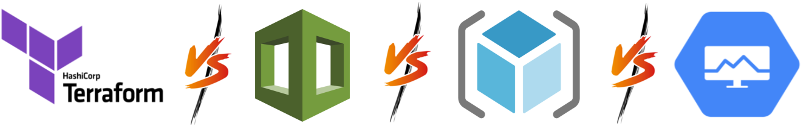

# Comparaison des Outils d'Infrastructure as Code

L'adoption croissante du Cloud Computing a renforcé l'importance de l'Infrastructure as Code (IaC) pour la gestion des ressources cloud. Les principaux fournisseurs cloud, tels qu'AWS, Azure et GCP, proposent leurs propres outils IaC. Parmi eux, Terraform a également gagné en popularité en raison de sa prise en charge multi-cloud. Examinons de plus près ces outils pour mieux comprendre leurs avantages et inconvénients respectifs.



## 1.Terraform

**Avantages de Terraform :**

- **Multi-cloud :** La capacité de provisionner des ressources sur différents fournisseurs cloud est un avantage majeur de Terraform, offrant une flexibilité inégalée.
- **Déclaration d'Infrastructure :** Son approche déclarative simplifie la définition des ressources via des fichiers de configuration (HCL - HashiCorp Configuration Language), facilitant ainsi la gestion des infrastructures complexes.
- **Grande Communauté :** Terraform bénéficie d'une communauté active, proposant de nombreuses ressources, modules et guides pour une variété de cas d'utilisation.

**Limitations de Terraform :**

- **Le Business modèle de HashCorp :** Terraform est une solution open source. Cependant, La maison mère de Terraform souhaite developper son business en poussant les developpeurs à l'utilisations de Terrarform Cloud qui offre beaucoup plus de fonctionnalités (FinOps, securité .. ) mais qui nous rend dépendant de HashiCorp.
- **Cycle de Vie des Fonctionnalités :** L'ajout de nouvelles fonctionnalités peut parfois être plus lent par rapport aux outils natifs des fournisseurs cloud.


```hcl title=" Exemple de Création d'une Instance EC2 sur AWS avec Terraform"
provider "aws" {
  region = "eu-west-3"
}

resource "aws_instance" "ma_vm" {
  ami           = "ami-0c55b159cbfafe1f0"
  instance_type = "t2.micro"
}
```

## 2.AWS CloudFormation

**Avantages de CloudFormation :**

- **Intégration Étroite avec AWS :** Offre une intégration directe avec l'écosystème AWS, facilitant le provisionnement et la gestion des ressources spécifiques à AWS.
- **Templating :** La création de modèles JSON ou YAML pour décrire l'infrastructure simplifie la gestion des ressources.

**Limitations de CloudFormation :**

- **Uniquement AWS :** Limité à l'environnement AWS, ne prenant pas en charge d'autres fournisseurs cloud.
- **Complexité de la Syntaxe :** La syntaxe peut être complexe et moins intuitive pour les débutants.


```yaml title="Exemple de Création d'une Instance EC2 sur AWS avec CloudFormation  "
Resources:
  MyInstance:
    Type: AWS::EC2::Instance
    Properties:
      ImageId: ami-0c55b159cbfafe1f0
      InstanceType: t2.micro
```


## 3.Azure Resource Manager (ARM) 

**Avantages des ARM :**

- **Intégration Étroite avec Azure :** Offre une gestion complète des ressources Azure avec une syntaxe spécifique aux templates ARM.
- **Ressources Avancées :** Permet de définir des dépendances et des validations entre les ressources.

**Limitations des ARM Templates :**

- **Spécifique à Azure :** Tout comme CloudFormation, les templates ARM sont limités à l'écosystème Azure uniquement.
- **Complexité de Syntaxe :** La syntaxe peut être complexe et moins conviviale pour les nouveaux utilisateurs.


```json title=" Exemple de Création d'une Machine Virtuelle sur Azure avec ARM "
{
  "$schema": "https://schema.management.azure.com/schemas/2019-04-01/deploymentTemplate.json#",
  "contentVersion": "1.0.0.0",
  "resources": [
    {
      "type": "Microsoft.Compute/virtualMachines",
      "apiVersion": "2021-04-01",
      "name": "myVM",
      "location": "East US",
      "properties": {
        "hardwareProfile": {
          "vmSize": "Standard_B1s"
        },
        "storageProfile": {
          "imageReference": {
            "publisher": "Canonical",
            "offer": "UbuntuServer",
            "sku": "18.04-LTS",
            "version": "latest"
          },
          "osDisk": {
            "createOption": "FromImage"
          }
        },
        "networkProfile": {
          "networkInterfaces": [
            {
              "id": "[resourceId('Microsoft.Network/networkInterfaces', 'myVMNic')]"
            }
          ]
        }
      }
    }
  ]
}
```

## 4.Google Cloud Deployment Manager

**Avantages de Deployment Manager :**

- **Intégration Étroite avec GCP :** Offre une gestion complète des ressources GCP avec une syntaxe dédiée.
- **Réutilisation des Modèles :** Permet de réutiliser des modèles pour simplifier le provisionnement d'infrastructures.

**Limitations de Deployment Manager :**

- **Limité à GCP :** Comme les autres outils natifs, il est limité à l'environnement GCP, excluant la prise en charge multi-cloud.
- **Complexité de Configuration :** La configuration peut devenir complexe pour les déploiements complexes.


```yaml title=" Exemple de Création d'une Instance VM sur GCP avec Deployment Manager "
resources:
- name: my-vm
  type: compute.v1.instance
  properties:
    zone: us-central1-a
    machineType: zones/us-central1-a/machineTypes/f1-micro
    disks:
    - deviceName: boot
      type: PERSISTENT
      boot: true
      autoDelete: true
      initializeParams:
        sourceImage: projects/ubuntu-os-cloud/global/images/family/ubuntu-2004-lts
```

## Conclusion

Chaque outil d'IaC a ses propres forces et faiblesses. Terraform se distingue par sa capacité multi-cloud, tandis que les outils natifs offrent une intégration étroite avec leurs environnements respectifs. Le choix dépend souvent des besoins spécifiques en matière de cloud, de la portabilité, de la complexité de l'infrastructure et du niveau de familiarité avec chaque outil.

Il est crucial de bien évaluer les besoins avant de choisir l'outil d'IaC afin de maximiser l'efficacité et la gestion des ressources dans un environnement cloud donné.
